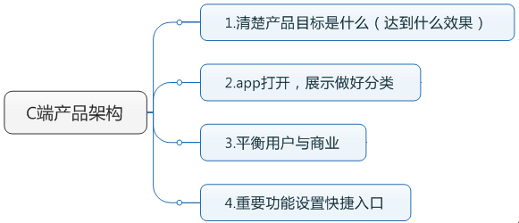

### 第一，要清楚产品目标是什么，是要解决什么问题，这些问题的以什么关系或方式连接起来的
##### 如：微信是提供人与人连接；人与消费的连接
##### 辅营代理商后台，是解决查询订单和管理商品等
<!--more-->
### 第二，按照产品的目标，设置分类的模块
##### 这个应用，这款产品功能模块上，分为哪些

### 第三，平衡用户体验和商业盈利
##### 如微信朋友圈开始推送广告的时候，怎么样做到，让投放广告商高兴，达到目的，也达到微信赚钱的目的；同时让用户又乐在其中

### 功能的快捷键入口
##### 功能的快捷键入口，要有清晰缜密的逻辑规划，不宜过多，简洁至上，又符合用户需求
