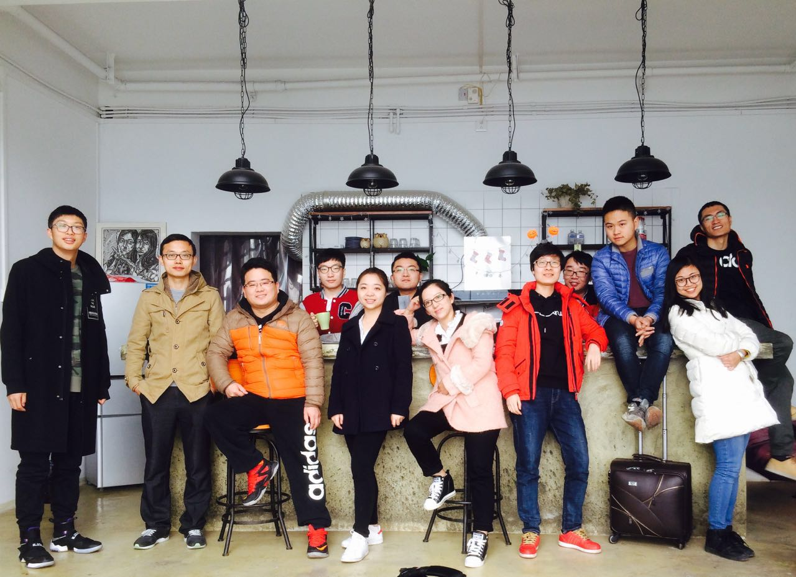
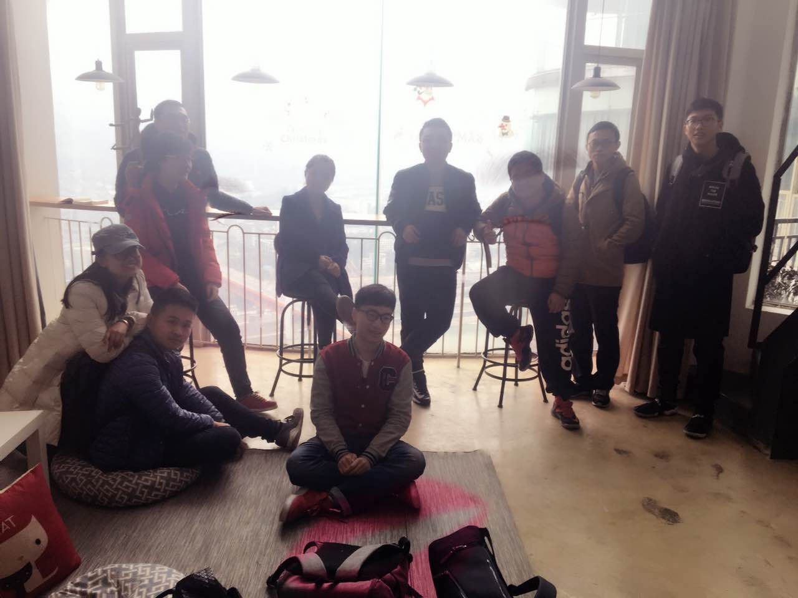
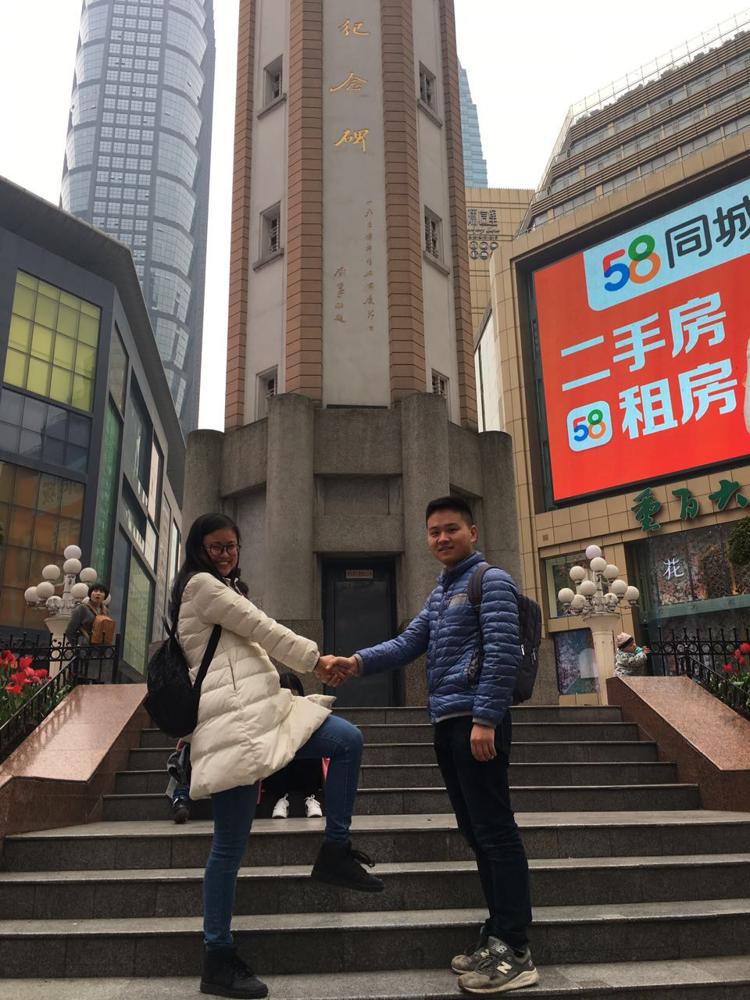

##### 现在在重庆，和去哪儿小伙伴一起到这里来TB；说到TB，和在去哪儿遇到的这群人一起玩耍，真的很开心，去年11月在泰国，想想也是一段很难忘的旅程。
<!--more-->
    
we're here

##### 说“我是属于这里的“，是想说，我是真的属于西南这片土地的，一直到现在都期望有一天就在昆明、成都或者重庆，度过余生。我长在云南，大学成长在成都，也很喜欢重庆这座接地气的都市。
##### 喜欢这些城市的生活气息，感觉每一个人都会热爱生活，因为他们有足够的时间生活。也许是因为你来这座城市的目的不一样，在一座城市工作久了，换一座城市时，就会当成你生活的港湾。

    
永远年轻

##### 重庆，对于我来说是一座有故事的城市。在来江北机场的路上，送机师傅放着“再回首”的音乐，突然有种非常释然，轻松的感觉，路在往前衍生，过去的风景一幕幕从你身边路过，他们仍然留在你的生活中，成为你的一部分。

##### 南方姑娘，你是否习惯北方的秋凉。又要回到北方，继续写你的故事。在北京，从2015年11月待到2016年2月份，再从2016年7月份到现在，在北京，和一个南方男孩，在一个屋檐下吵吵闹闹，笑着，陪伴着彼此从男孩女孩成长为更大的男孩女孩，希望我们永远这样年轻，永远可以这样热泪盈眶，但又希望彼此都可以成熟一些，毕竟未来那个小家的生活，可能离我们真的不远了。从小都是一个人跌跌撞撞长大，爸爸妈妈只是在一旁，引导着你，谢谢他们让我自己长大，鼓励我追求我自己的脚步和生活，只是现在我远离家乡，但我相信，再坚持一会儿，我很快就归来，毕竟，我是属于这里的。

    
you and me

##### 这次在重庆，有几个特别有感觉的瞬间。和男友去他大学母校重邮的路上，看到他一路上兴奋的拍下每一个拐角路口，每一个路标的时候，我的内心是喜悦的，内心的充裕的，觉得自己是很幸福的。男友是一个热爱生活，有感情，内心充盈，追寻内心声音的男生，或许吧。说重庆是个三维的城市，就像游戏“纪念碑谷”里面的建筑一样，换一个角度看一座建筑，看到的就可能是新的建筑；从房屋里面的楼梯或者电梯上下之后，出去之后是另一个平台，而不单单只是在这栋房屋里。想去一个地方，你可以从房屋里上楼传出去，也可绕着房屋走过去，你像在走迷宫，或许只有常年生活在重庆的人，才能体会这种秘制生活空间。这就像我们的生活吧，从这个方向走了，从这个房间进去了，不代表与别的路分道扬镳了，生活永远会在拐角处给你惊喜，只要你不要放弃。空间的转换与变化，时空的斗转星移，生活的时过境迁，无论如何风云莫测，回到从从容容、平平淡淡的生活中，这才是真。

##### 就这样吧，暂别，这里。我是属于这里的
