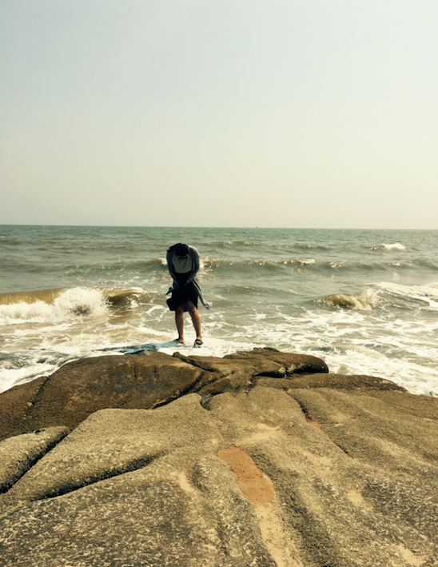
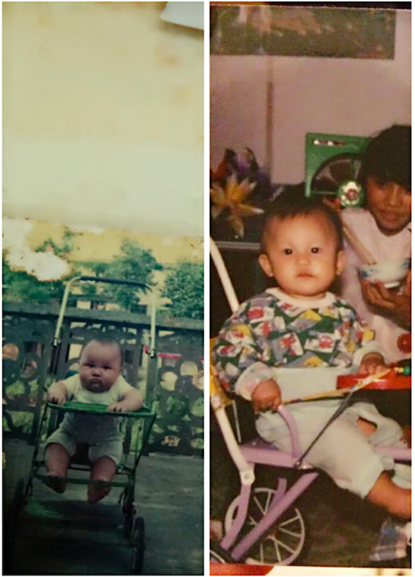

##### 现在是5月份下旬，5月22日，现在我和文祥在秦皇岛，窗外是呼啸的海风和滚滚而来的海浪，像极了快到冬天的感觉。
##### 这个五月，我辞职了，从大厂去哪儿，去了家还在起步阶段的创业公司，离开是因为不开心，因为没成长，因为没机会，其实也因为我不会相处吧。去了新的环境，我有新的期待，决定大干一番。文祥很支持我，这个平日里不说话的男孩子，是思考后，全力支持我的。我也相信我自己。
<!--more-->

##### 秦皇岛的南戴河，昨天前天还是阳光明媚，可以把我们晒成黑煤球，海风徐徐有些冷意，但还是爽快。然而现在的海边，没有一个人，大概没人敢靠近吧，面对汹涌，只能畏惧。
##### 刚刚在来秦皇岛火车站的路上，顺风车司机有些有趣。略带东北腔的秦皇岛口音讲述着他遇到的有趣的事情，他喜欢和乘客聊天，字里行间会叹气，但口音读出他对家庭小幸福生活的满足，对自己人生如意事情的怀念，买有太多对世俗的追求，清淡确幸运的人生。
##### 在出酒店时，妈妈给我打电话，说想跟我视频聊天，我妈妈会在任何时候说想跟我视频聊天，不论早上8点多，还是下午3点左右，还是晚上9点左右。我妈妈不怎么会考虑说你这个时候在干嘛，合不合适，这就是妈妈吧，跟妈妈，可以anytime。这个年纪的我们，二十多岁，需要很多，也有很多人需要我们，我想了想，我应该可以最起码每天给家里打一个电话，这个要求不过分吧，但我都没做到。以后，我可以每天打一个电话，时间充裕的时候视频，让他们感觉，女儿虽然不在身边，但她没有走远。跟爸妈讲你现在的工作和生活状态，不论好与坏，如果心情不太好，也告诉他们，但一定不会表现得会让他们担心，因为我都不会担心我自己。这是个生活的悖论，你想把北京和云南的距离用密切的沟通拉短，好像你掌握爸妈的动向，他们今早、中午、下午做什么了，爸妈知道你今天做什么了，心情怎么样，成长怎么样，好像这样就挺好的。但是，你跟他们聊你在北京的生活状态，他们感受不到。会用他们的视角审视这件事情，你会像从小一样，坚持自我。爸妈不是你，不是你这个年纪的人，他们再七八十年代经历过的，你没有经历过，你在二十几岁这个年纪在外地，在北京看到的，想到的，他们体会不到，有一天我也会变成这样，和我儿子女儿有一个世纪的距离，但或许我会自己去探索，是一个潮妈妈，我希望是这样。
##### 离开去哪儿这件事情，说真的，我没有多大感觉，可能真的是要离开的，应该离开的。当然那群朋友，回事一辈子的财富。只是那天我在工位，整理要交接的工作，写了好多wiki，我竟然写着写着哭了，那些需求项目，都是我的成长，一步一步走过来，一个一个功能，看着自己做的这些功能要让给别人，说实话，有种自己养的猪呗别人拱的感觉。
##### 不过吧，人生就是不断的别离，认真说再见的人一定会再见。有的别离，我一定会回去，那是家乡。有的别离，我一定会以更精彩的身影出现。

