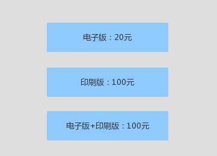

### 日常生活中的每天
##### 我们平时的生活中有很多看似很平常的行为，因为这些行为转瞬即逝，节奏太快，我们平时不会关注，也不会放在慢镜头里来回味，研究。这本书就把这些行为放大，用实验的方式证实一些假设，从而解释平常我们做出的选择、行为究竟是为什么，其中有些很有意思的东西想写下来。
##### 现在习惯了边看书的时候，用笔写下当时的想法；等把整本书都看完时，我再次翻开目录，看着标题，回想当时书里读到的内容。这个时候，我想起来的，就是让我印象深刻的，可能这是一种对我来说，比较好的记录书中所看，所思的方式。
<!--more-->
### 奇妙的选择
##### 大学时，记得有一次课堂上任意选择话题分享，我分享了乔布斯，当时读了《乔布斯自传》，真的是热血沸腾，我总是容易被这样的故事吸引，记得当时我把 苹果广告Think different 的广告词，抄在本子上，早上去池边早读时，都要拿出来读，甚至背下来。好喜欢这段广告词：
``
Because the people who are crazy enough tothink因为只有那些足够疯狂认为
they can change the world, 可以改变世界的人
Are the ones who do. 才能真正才能真正做到这一点
``
##### 说远了，说到乔布斯，就停不下来了，回来...很喜欢乔布斯的一个观点：用户很多时候不知道自己喜欢什么，而是需要你来帮他们做出选择，告诉他们需要什么。所有呢，靠着这句话，iphone遍布全世界。我们都说用户驱动产品，调研用户需求，根据需求，创新和迭代产品。但这样一来，创新二字何来呢？这本书中，第一个故事，就挺让我喜欢的，“我可以决定你会选择什么”，这全靠我给你提供的选择决定。
##### 一个报社要销售报纸，给出了三个报价：

##### 显而易见，几乎所有人都只会选择第一种或者第三种，实验结果表明，没有人选择第二种。提供的品类和报价是可以通过调整，而达到不同的效果。这样提供的三种选择，看上去，用户会觉得卖家傻，这是提供错了吧，实际上，我就是为了销售第三种套餐，而且我可以控制价格区间，用户会持续一段时间认为自己得到了实惠。这样的买卖，有啥不愿意的呢。
### 社会规范与市场规范
##### 社会规范维系的是人与人之间，由于亲密建立的情感交易；市场规范是用于交换或交易的。雇佣关系属于市场规范，但同时也会掺杂着社会规范，但这里面的社会规范很难建立真正的社会规范，也就是在雇佣关系中，很难建立与老板之间真正的情感。但这个际遇得看个人，得看老板，人与人之间还是有很大不同的，不同风格的老板，所触及的社会规范和市场规范也不同，对这两者的处理，也会因为个人而又不同的结果。
##### 一旦社会规范加入了市场规范的东西，就很难再轨道社会规范中了。所以，与朋友之间，多些情感上的交流，送礼物比送金钱更能维系一段情感。当然，在当今是生活中，现金已然不是工具，或者不被人们所公认，因为沾染上这个字眼，总会觉得怪怪的。我相信，送人礼物，是情谊到了，关系达得到这个程度，才合适做的事情，社会规范的也只有在恰当的时候，才来得自然而然，让人舒服。
### 性兴奋的影响
##### 对了，这本书一直在强调人类行为的非理性，人们很难长时间保持理性的头脑和做出理性的行为，所以完全理性可能是不存在的。不过可能正是因为非理性的存在，每天都会发生各种各样生活中有趣的事情。《怪诞行为学》中在性兴奋状态下人们做决定，做了很多实验，结果人们在这种特殊状态下，会做出不一样的决定，甚至是大相径庭。
##### 《猫鼠游戏》中莱昂纳多能够在行骗那么多，说来是有点夸张，但其实他就是利用了人们的虚荣，以及在特殊的荷尔蒙下，对当前事实的误导，或者可能认为就是陷阱，但依然愿意飞蛾扑火。要做一个清心寡欲的和尚没那么简单，看破红尘也没那么简单，但可以避免频繁陷入这样的诱惑中，及时抽离出来，有些弯路，人总是要走的。

### 多种选择的困境
##### 这个很常见吧，选择多了，人就蒙了，到最后，很可能什么都不选了。有些时候，比如在逛街，时间有点紧张，你试了第一家点的衣服，觉得还可以，但总觉得没逛完，心里告诉自己一定会有更好的，所以浪费了很多时间逛接下来的店铺。到最后，你还是返回第一家点买了这件衣服，然后你觉得效率很低，其余的店都是白逛了。在某些选择的时候，我宁愿多花钱，省去挑选的时间，也不愿意多花时间，省去一点点钱。这个就像，离你家稍远一点的菜市场鸡蛋卖4.5一斤，你家楼下鸡蛋卖5元，你愿意去稍远的一家买鸡蛋。但电冰箱你家楼下卖1000，稍远一点的卖1010，你就只会在楼下买；像这样的选择，无伤大雅的，不必纠结。
##### 记得高中政治来时说过一句话，在一些重大选择面前，人们往往不用思考太多，因为思考太久也没有说明用，做出任何一个选择，对你以后十几年升值几十年的影响不会太大。关键是做出这个选择后，你该在这个选择中如何生活，才是决定你生活的因素。
##### 书中有个实验例子，有10个房间，里面有不同的豆子，每个房间里的豆子数量人们都不知道，每个人有三次选定拿走房间豆子的机会；每个房间都可以进入，只是你的决定必须在出每个房间前，决定选择还是放弃。这种情况下，怎么样才能拿到最多的豆子呢。我想这是个考验人心理的实验，跟运气没太大关系，跟贪婪有关系。

### 约会轶事
##### 如果你去参加party，想提升你在party上约会成功的几率的话，最好带一个同伴去。这个同伴考验外贸上跟你差不多，但没你聪慧，会说话；或者跟你一样聪慧，但长相稍微差你一点。这样可以大大提高你约会成功的几率，为什么呢？
##### 首先，你带的同伴，如果乍一看跟你差不多，实际相处一会儿，会觉得你更加优秀，这样就凸显了你。当然，这件事情永远不要让你同伴知道。（书中这么说的，哈哈）

### 安慰剂的需要
##### 有没有这样的情况，你感冒好久，一直没好，你都快绝望了。后来去药店，药店的人说你拖太久，得吃贵的要，于是你买了贵的药。然后你吃了两天后，奇迹般的好了。
##### 书中有个作者，之前每次坐飞机，都会吃一种叫“航空腾泡片”的药，用来预防在高空飞行中的细菌。作者每次起飞或降落后都会吃，一直感觉非常棒，觉得这个药帮自己避免了很多细菌。结果最后这个药的发明者因生产假药被捕，但作者却对这个事情的曝光，很失望，他似乎很想沉浸在这种药带给他的良好感觉中。
##### 事实上，有一部分药，可能没什么药效，但确确实实在心理安慰上做出了很大的贡献；安慰疗法似乎也可以应用，但医疗上如何对生命做出正确的治疗，不是我们能决定的，有的时候，医生都可能决定不了。所以，我们需要安慰剂，我们需要有时火灾美丽的谎言中，因为这样，我们可以从内心肯定自己，正向对待自己，从而自己产生一种自己愈合的什么，或许是药吧。
