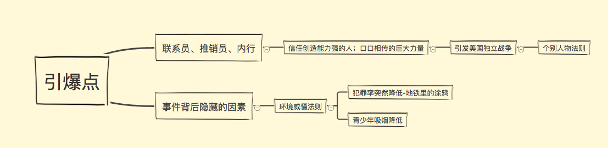
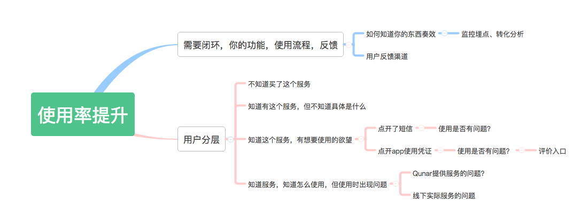

layout: post
title: Reading《引爆点》
tags: [index,note]
date: 2017-03-12
img: point.jpg
color: "#f47920"
---
### 引爆点是什么
##### 引爆点是什么，是你一直认为这件事情就会这样发展下去的时候，突然这件事情发生了质变。引爆点是，女大十八变，你一直以为她会很丑，永远不会改变，但突然有一天你看见她，变成了白天鹅，楚楚动人。引爆点不一定是导火索，引爆点可能是我们高中历史教材中说的客观原因，也可能是根本原因。但似乎这些原因仅仅只是我们认为的原因，特别是在互联网社会中，引起一件事情或一种现象的流行，他的原因很多，但占比最大的原因往往不容易被人们发现，但发现的人总能掀起一场变革。
<!--more-->

##### 《引爆点》这本书，我觉得很精彩，他的方法论像是在总结古老的理论，但让人看了后有那么激动，以至于在我坐在北京的公交上，看着车窗外一座座高耸的大楼，国贸附近，我油然而生一种激动，或是说感动，行走的思想那么伟大。
### 联系员、推销员、内行
##### 联系员、推销员、内行，三者经典的角色，对时间的引爆在有些情况下是最关键的，这是《引爆点》一书总结的第一条经验。要想发起流行潮，就必须做到把有限的资源集中用到关键方面。个别人物法则认为，联系员、内行和推销员应该充当口头信息传播潮的发起者，也就是说，如果你对发起口头信息传播潮感兴趣的话，你的有限资源应当集中用于这三类人身上，其他人都无关紧要。书中的栗子，我印象特别深刻，美国独立战争的爆发，竟然是出自一句应该是传言的话，但正好传到一个比较有威望，大家都比较信任的人这里，这个人是个值得信任的联系员，也会是收到人们爱戴的内行，所以在他的进一步传播，骑马在村里呼喊，人们都行动起来，所以引发了美国独立战争。看似很不可思议吧，确实口口相传能引起巨大作用的栗子不少。想到我们的生活中，我们做很多事情，只要能想办法站到人脉咨询的，我们就会不惜代价找到这个人脉，担心自己上当，所以把这份担心找个你认为可以信任的人，其实是帮你解惑，心里放松地购买某种东西。比如买车，我们总希望找到熟人，或深度人脉挖掘，也不惜代价找到熟人行家，认为这样自己就可以不吃亏。生活中的很多交易，有一定比例是在熟人内行这个圈子中成交的。想起我在成都和一个美国人聊天，他问我在哪里找到的工作。当时我大学刚刚毕业，很骄傲的叙述了我怎样投简历，怎样在成都各大高校中笔试、面试，最后层层通关，拿到了心仪的offer。但这个美国人一脸疑惑，跟我说到，为什么不靠你的朋友介绍工作，为什么不直接找认识的人介绍你到你心仪的企业，在他的认知中，人脉是在你找工作时，最有效的方式，因为一度人脉清楚你是谁，需要什么，适合什么，由一度人脉到二度人脉，再深层次挖掘。是那个时候的认知水平想不到这个层面，也是中国大学毕业生和美国不同的背景文化影响的，不过现在想起那个美国人说的这番话和他当时的表情，我懂得了他的意思。
### “环境威慑法则”
##### “环境威慑法则”，是《引爆点》这本书中，讲述最多的内容。引起事件发生改变的 ，往往是一些你看不见的因素，发掘这些因素，才可以对症下药。美国有段时间街头犯罪率居高不下，街区加大警力，维护治安，都不奏效。但仅仅把街区地铁里面的涂鸦擦干净，这个简单的举动，竟然使犯罪率下降了，很不可思吧。这样做是透过犯罪这个现象，分析街头犯罪的嫌疑人的年龄，研究追踪发现这部分群体的特征，他们会什么时间段做什么事情，所做的这些事情，对他们的行为有什么影响。就像debug一样，将事件一步步执行，仔细检查每一个细节，思考这些细节背后的附着力因素，才能好发现隐藏的因素。找到这个因素的过程是复杂和痛苦的，但是找出这个因素，却可以毫不费力的解决你棘手的问题，我觉得非常巧妙！我们在工作或生活中，时时刻刻都容易受定势思维影响，按照看似没有问题的流程去思考问题，其实等于没有思考。人们对一件事情的阻止或处理方法，往往会通过表面现象，按照表面逻辑去解决，其实这种表面逻辑看似很符合逻辑，很多人能接受，但却不一定是这件事情发生的原因。。比如让孩子们不能接触毒品，斩断所有途径，看似很有效，其实不一定。但人们仍然愿意选择这样做的原因，可能是因为这种方式简单，人们自认为很有效。我在做的提升贵宾室使用率的这件事情，我只是一直站在我做产品的角度，替用户思考，一直致力于提升让用户知道购买了这个服务的途径，当然这个是最基本的，最基础的服务。但是应该静下来，梳理每个流程，从售卖到用户使用，这整个过程中涉及的问题方向，思考用户不使用你的贵宾室的背后，存在什么问题。

